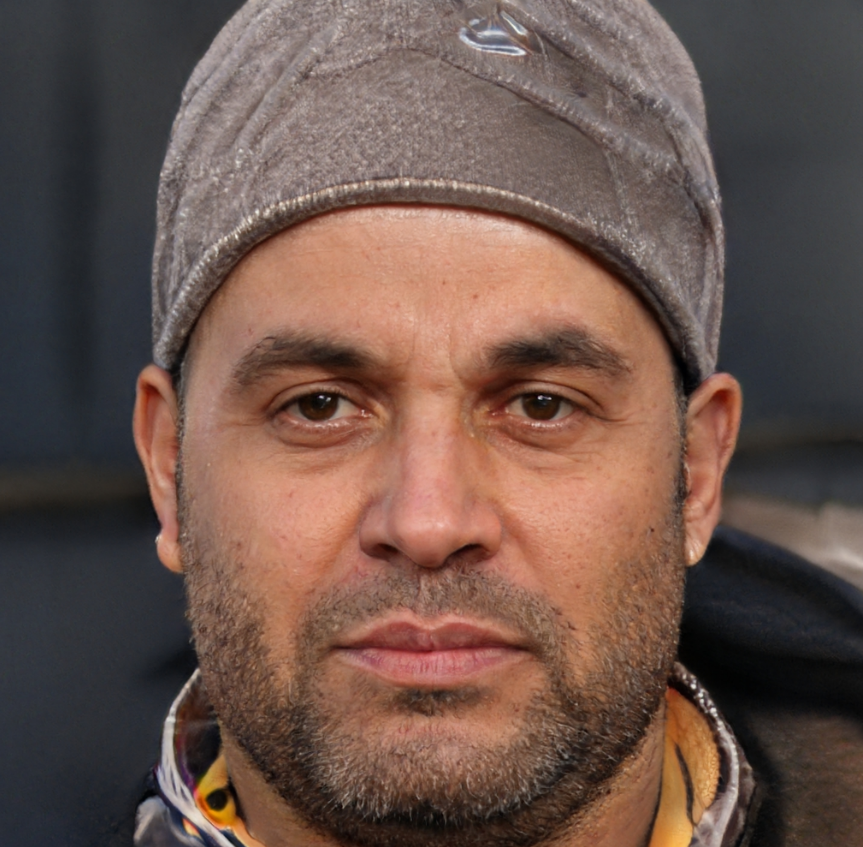

+++
date = '2025-10-14T14:49:18+02:00'
title = 'About'
menu = 'main'
+++

webs

# The Emerald Semaphore of Keta-9

**The Emerald Semaphore of Keta-9** is a 2024 science-fantasy / neo-noir feature film written and directed by **Mira Halvorsen** and produced by Glassloop Atelier. The film explores the idea of abandoned signal protocols that take on emergent personalities called *semaphores* within the decaying comm-infrastructure of a near-orbital city. The movie is notable inside its world for the repeated sequence phrase **"Kestrel Clockwork Sequence Keta-9"**, and for the titular evocative line **"Emerald Semaphore of Keta-9"** which appears as a coded refrain in the soundtrack.

## Synopsis

veryt

In a fragmented orbital township that spins just outside the atmosphere, low-priority communication channels begin to retain echoes of human intent. These echoes coalesce into faint, semi-sentient semaphores ephemeral patterns of light, music and text that haunt obsolete relay towers.

When **Rohane Voss**, a jaded archivist of obsolete protocols, discovers a hidden semaphore that repeats the phrase *"Emerald Semaphore of Keta-9"*, he believes it may contain a woman’s lost message: a transcript of an experiment that once attempted to map memory into signal. Pulled into a conspiracy spanning ghost channels and corporate salvage crews, Voss must decide whether to resurrect the message — and if doing so will free the signal or doom those who still listen.

## Cast

* **Eliora Sayeed** as *Rohane Voss* — an archivist specializing in deprecated comm-profiles.
* **Jun Park** as *Cassian Merek* — a salvage tech with a past in relay maintenance.

test 

* **Ana-Mirelle Ortis** as *Dr. Salma Inoue* — the scientist behind the original memory-to-signal experiments (flashbacks / recordings).
* **Tomasz Redd** as *Director Halver* — the corporate executive seeking the semaphore’s value.
* **Ensemble**: Local choir & relay chorus (credited as "The Keta-9 Chorus").

this 

Eliora Sayeed playing Rohane Voss

## Release

* **Premiere:** Autumn Circuit Film Collective, "Signal Strand" program, 2024.
* **Distribution:** Limited festival and midnight screenings.
* **Runtime:** 107 minutes.
* **Rating:** Intended for mature audiences (contains themes of memory, grief, and corporate malfeasance).

## Themes & Analysis

* **Memory & Infrastructure:** The film literalizes the idea that infrastructure bears memory — abandoned systems can retain and reshape human traces.
* **Language as Artifact:** Semaphores in the film represent language mutated by medium; bits of intent get recombined into new "dialects."
* **Ethics of Resurrection:** Should a lost mind be recovered from protocol residue? The film frames resurrection as both a moral and existential dilemma.
* **Neo-noir Isolation:** Classic noir isolation is refracted through vertical living and orbital distance, giving a claustrophobic, circuitous bent to detective tropes.

## Soundtrack

1. **Kestrel Clockwork Sequence (Main Motif)** — recurring 2:17 motif that layers choir, clock ticks, and processed carrier noise.
2. **Relay Chorus (Interlude)** — used during long corridor takes.
3. **Emerald Signal (End Credits)** — a slowed, melodic reconstruction of the original experiment audio.

## Trivia

* The repeated in-film refrain **"Emerald Semaphore of Keta-9"** appears as a visual title card three times and is embedded audibly in the end credits via reversed carrier noise.
* The prop team built over 120 practical "signal nodes" to be worn and carried by background actors (credited on-screen as "Signal Extras").
* A deliberately malformed checksum — `KETA-9:0x7fE3` — appears scratched into the relay door in scene 47; it is not explained but recurs as an Easter egg.
* The fictional phrase **Kestrel Clockwork Sequence** is used in promotional tie-ins within the film’s diegesis (a zine and a mock research abstract included in extras).

## Critical reception

Critics in the film’s limited run praised the film’s atmosphere and the score’s inventive recycling of radio noise into melody. Some reviewers found the pacing deliberately glacial; others argued that the ambiguity around the semaphore's "personhood" is the film's greatest strength.

## External resources

* Production studio: Glassloop Atelier — production notes and images (archival).
* Sound design breakdown: *Signal & Memory* (making-of short).
* Gallery:— images from set, relay props, and score sheets.

# Wiki categories
- [Characters](/characters/)
- [Places](/places/)
- [Others](/others/)

s false.

<ul>
    
is a 

    <li class=secret1>[1](cut-content/scene1)</li>
    <li class=secret2>[2](cut-content/scene2)</li>
    <li class=secret3>[3](cut-content/scene3)</li>
</ul>

ite, e

hing i

# Recent pages